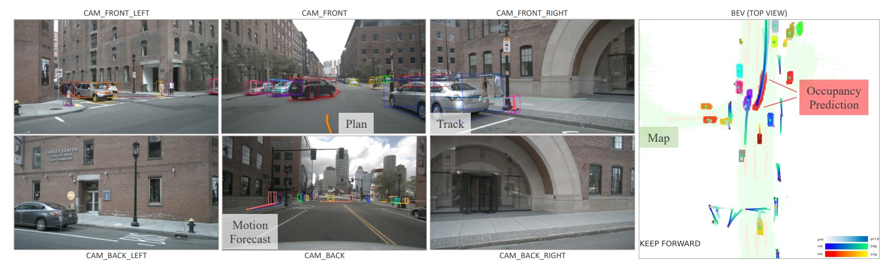
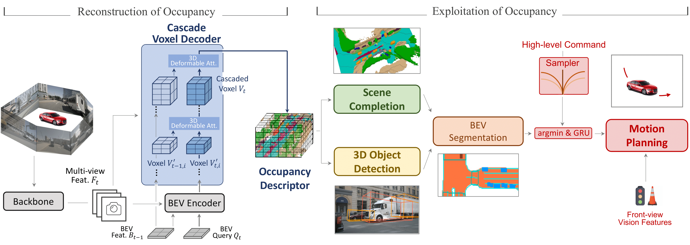

# 
Modern Autonomous Driving
  

  

## End-to-End Solution

Planning-oriented Autonomous Driving

    

Modern autonomous driving system is characterized as modular tasks in sequential order, i.e., perception, prediction, and planning. In order to perform a wide diversity of tasks and achieve advanced-level intelligence, contemporary approaches either deploy standalone models for individual tasks, or design a multi-task paradigm with separate heads. However, they might suffer from accumulative errors or deficient task coordination. Instead, we argue that a favorable framework should be devised and optimized in pursuit of the ultimate goal, i.e., planning of the self-driving car. Oriented at this, we revisit the key components within perception and prediction, and prioritize the tasks such that all these tasks contribute to planning. We introduce Unified Autonomous Driving (UniAD), a comprehensive framework up-to-date that incorporates full-stack driving tasks in one network. It is exquisitely devised to leverage advantages of each module, and provide complementary feature abstractions for agent interaction from a global perspective. Tasks are communicated with unified query interfaces to facilitate each other toward planning. We instantiate UniAD on the challenging nuScenes benchmark. With extensive ablations, the effectiveness of using such a philosophy is proven by substantially outperforming previous state-of-the-arts in all aspects. Code and models are public.
 
paper: https://arxiv.org/pdf/2212.10156.pdf  
code: https://github.com/OpenDriveLab/UniAD  
project: https://opendrivelab.github.io/UniAD    

Scene as Occupancy

    

Human driver can easily describe the complex traffic scene by visual system. Such an ability of precise perception is essential for driver's planning. To achieve this, a geometry-aware representation that quantizes the physical 3D scene into structured grid map with semantic labels per cell, termed as 3D Occupancy, would be desirable. Compared to the form of bounding box, a key insight behind occupancy is that it could capture the fine-grained details of critical obstacles in the scene, and thereby facilitate subsequent tasks. Prior or concurrent literature mainly concentrate on a single scene completion task, where we might argue that the potential of this occupancy representation might obsess broader impact. In this paper, we propose OccNet, a multi-view vision-centric pipeline with a cascade and temporal voxel decoder to reconstruct 3D occupancy. At the core of OccNet is a general occupancy embedding to represent 3D physical world. Such a descriptor could be applied towards a wide span of driving tasks, including detection, segmentation and planning. To validate the effectiveness of this new representation and our proposed algorithm, we propose OpenOcc, the first dense high-quality 3D occupancy benchmark built on top of nuScenes. Empirical experiments show that there are evident performance gain across multiple tasks, e.g., motion planning could witness a collision rate reduction by 15%-58%, demonstrating the superiority of our method.

paper: https://arxiv.org/pdf/2306.02851.pdf  
code: https://github.com/OpenDriveLab/OccNet    

